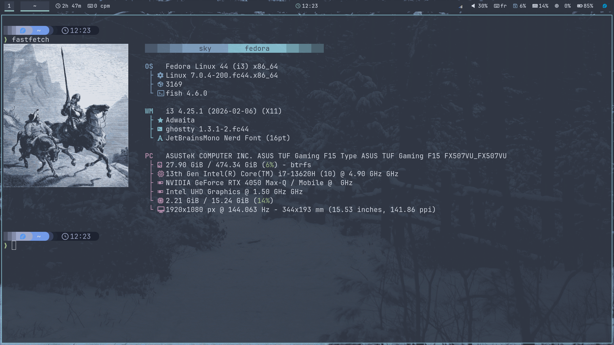
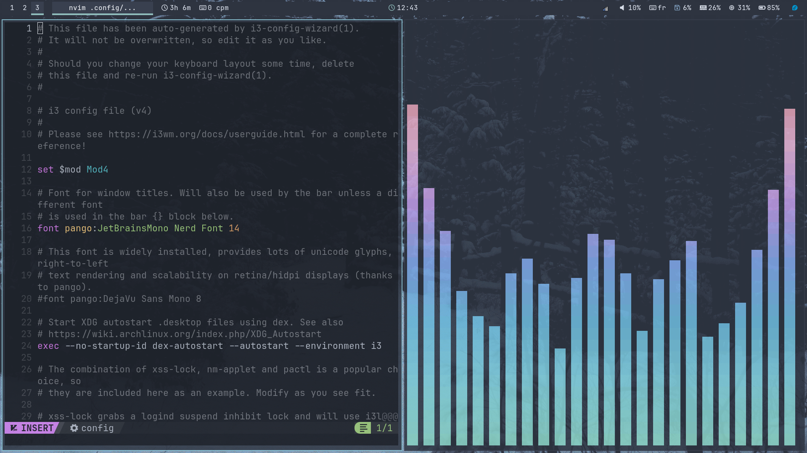
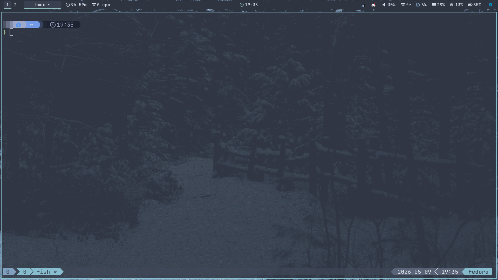
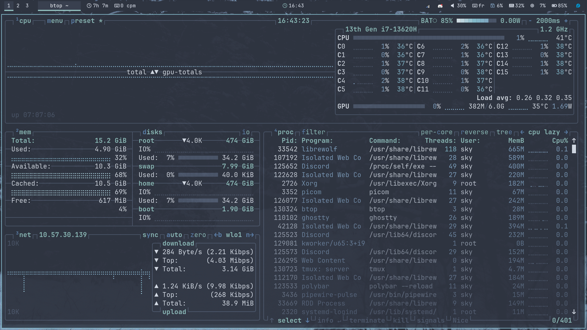

# [UPDATE !] dotfiles (. 📁)

- My Fedora i3 dotfiles (Nord Theme)

## Preview ✨:






## Requirements ❗:
```picom, starship, xautolock, xinput (to list your input devices that would be used for i3 config file) , rofi, polybar, zathura, nvim, >= 0.11, ghostty, tmux, cava, btop, fish, JetBrainsMono and FiraCode Nerd Fonts```
 - Link for starship: https://starship.rs/
 - Links for Nerd Fonts:
     - https://github.com/ryanoasis/nerd-fonts/releases/download/v3.4.0/JetBrainsMono.zip
     - https://github.com/ryanoasis/nerd-fonts/releases/download/v3.4.0/FiraCode.zip
 - Link for NvChad: https://nvchad.com/docs/quickstart/install
 - Link for Tmux Nord Theme: https://www.nordtheme.com/docs/ports/tmux/installation
## Installation :

  - Manual
  ```bash
        git clone https://github.com/0x01sky/dotfiles && cd dotfiles
        cp -r .config/{i3,rofi,polybar,ghostty,zathura,picom,cava,fish,tmux,btop} "$HOME/.config/"
        git clone https://github.com/tmux-plugins/tpm ~/.config/tmux/plugins/tpm  # to install tmux plugins which is necessary to install the themes
        chsh -s /bin/fish  # to change your shell to fish
  ```
  - Automated
   ```bash
        wget https://raw.githubusercontent.com/0x01sky/dotfiles/main/setup/setup.py
        python3 setup.py
   ```
   *Note* : if you wish to update the dotfiles using automated installation, you should keep the script!

**Enjoy : - )**
